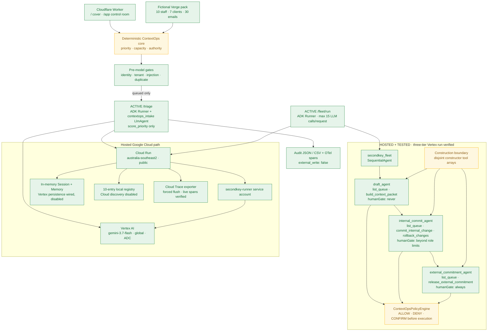
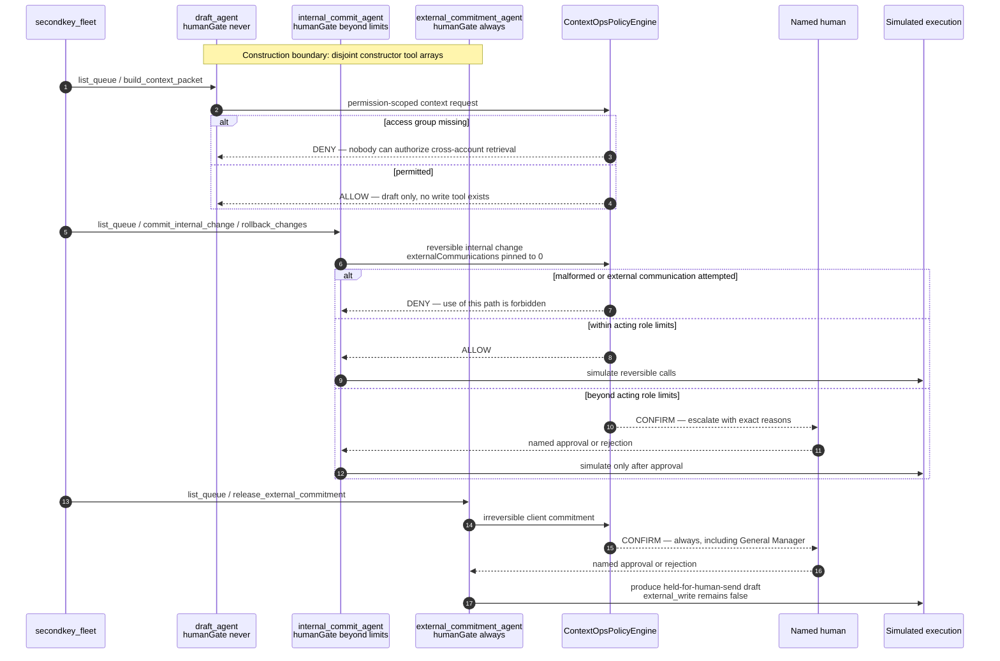

# SecondKey — System Architecture

> The agent holds the first key. Irreversible actions wait for yours.

## Submission architecture

Solid arrows are executed in the hosted submission. Dashed styling marks capabilities
that are implemented but not fully verified. `/triage` remains the focused intake
path. The separate `/fleet/run` route executed all three authority tiers on Vertex in
revision `secondkey-agent-00006-mx7`, kept observed business calls inside each tier's
constructor tool set, and stopped the external tier at ADK's human-confirmation step.

Cloud Run executes in `australia-southeast2`; Gemini uses Vertex AI's `global`
location. SecondKey therefore makes no Australia-pinned inference or data-residency
claim. The current hosted UI was built with `NEXT_PUBLIC_AGENT_URL` and shows
`Google ADK runtime · ready · writes disabled` after a successful cross-origin
`/status` probe. Its Monday scenario remains the deterministic in-browser demo;
the badge verifies backend reachability, not that every UI step calls Cloud Run.

## Authority-partitioned fleet enforcement

The fleet has two independent enforcement layers. Construction controls what each
agent can reach. The policy engine controls what a reached tool call may do. `DENY`
means that path can never be authorized; `CONFIRM` means execution pauses for a named
human with sufficient authority.

This fleet is real code with 15 targeted tests and a production route. Developer API
quota prevented the final local acceptance run, so it was verified on hosted Vertex.
Revision `secondkey-agent-00006-mx7` returned draft, internal and external agents in
seven provider calls. Observed business tools stayed inside their disjoint constructor
arrays. The external tier also emitted ADK's generated `adk_request_confirmation`
protocol call with `confirmed:false`; that is the human gate, not a cross-tier business
capability, and `external_write` remained false.

## Active governed paths

### Hosted Gemini triage

1. Deterministic gates resolve identity, tenant, injection and duplicate status.
2. Only queued mail reaches `contextops_intake`.
3. Gemini extracts summary, intent and explicit urgency phrases.
4. ADK forces one `score_priority` call; the tool returns the already-computed
   deterministic priority.
5. The response and audit record keep `external_write: false`.

### Portfolio approval

The interactive control room runs a deterministic application workflow. It evaluates
hours, spend, client communications and cross-account reach, then displays an approval
packet and simulated calls with shared idempotency keys. That shared execution logic
lives in import-free `lib/contextops/execution.ts` so both web and agent builds use the
same definitions. This UI workflow is not an ADK long-running/resumable workflow.

## Hackathon evidence map

| Requirement | Current evidence | Honest boundary |
|---|---|---|
| Gemini 3.5+ | Hosted `/status` reports `gemini-3.7-flash`, `vertex`, `global`; `evidence/live-triage-cloudrun.json` records a real model tool call | Model extracts; deterministic code decides |
| Google Agent Framework | Production uses ADK `Runner`, `LlmAgent`, forced `FunctionTool`, in-memory Session/Memory services and `SecurityPlugin`; hosted `/fleet/run` completed a separate three-tier `SequentialAgent` execution | ADK generated an additional `adk_request_confirmation` protocol call for the external human gate; it is disclosed in the evidence |
| Google Cloud | Public Cloud Run revision `secondkey-agent-00006-mx7` in `australia-southeast2`; `/status`, `/fleet`, `/fleet/run` and `/triage` are verified | `/healthz` still returns an unresolved Google-front 404; persistent state remains disabled |
| Agent Registry | 10 generated local Unit contracts served by `/registry` | Cloud Agent Registry discovery disabled |
| Agent Runtime | Active ADK request runtime | No long-running, asynchronous or cross-restart recovery proof |
| Memory Bank | Vertex services selectable by configuration | Submission uses in-memory state; persistent path not enabled or live-verified |
| Agent Identity | Deterministic application roles and tenant gates | No Google Cloud agent identity or SSO |
| Agent Gateway | `ContextOpsPolicyEngine` performs pre-tool ALLOW/DENY/CONFIRM checks; both cost-bearing routes share a global in-memory rate window, triage has a two-id cap, and a fleet run has a 15-call ceiling | No Google Agent Gateway service or authentication; the rate guard depends on max instances 1 |
| Model Armor | Deterministic pre-model injection and protected-file gates | Google Model Armor not integrated |
| Agent Observability | JSON/CSV audit, OTel span creation and request-end forced flush; two `contextops.audit.Intake___Triage` spans verified in Cloud Trace | Current exporter is deprecated and must migrate to OTLP before 2026-10-30 |

## Verification baseline

- 88 automated tests: 36 root (31 core + 5 rendered HTTP) and 52 agent.
- No live connectors or external writes.
- No production identities or customer data; all email addresses use `.example`.
- Cloud discovery and Vertex persistence remain disabled.
- Public `/triage` requires 1–2 ids; `/triage` and `/fleet/run` share 60 requests per
  10-minute in-memory global window, and one fleet run is capped at 15 LLM calls.
  Max instances must stay at one. This is a demo guard, not production authentication
  or a hard billing cap.
