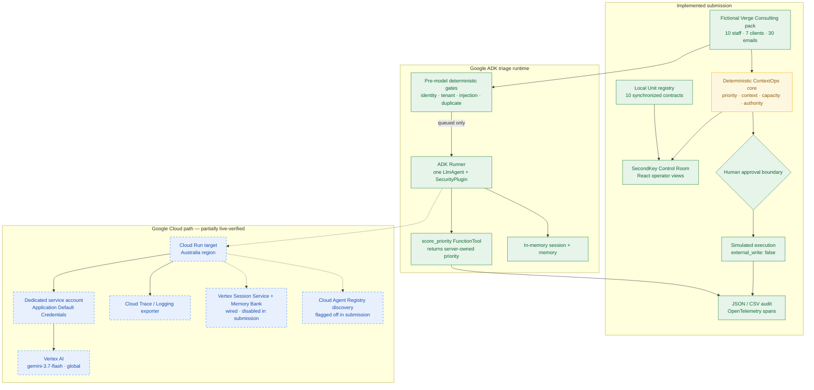
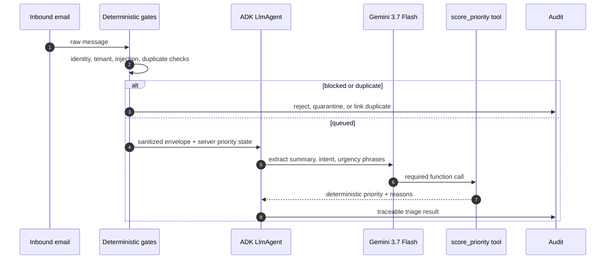
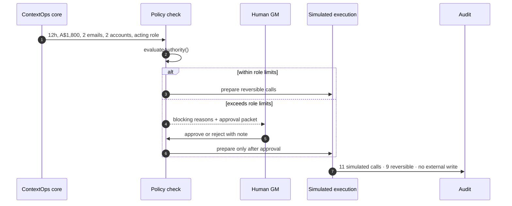

# SecondKey — System Architecture

> The agent holds the first key. Irreversible actions wait for yours.

## Submission architecture

Solid lines below are implemented and locally verified. The Google Cloud deployment is
partially live-verified: Cloud Run revisions are Ready, and a Cloud Build smoke run used
service-account ADC to call Vertex AI successfully. The Cloud Run public route is not
yet verified because Google's front end currently returns 404 before reaching the
container.

Public copy says **Australia region**; the deployment command in `README.md` retains
Google Cloud's exact provider region identifier because the CLI requires it. Gemini
model inference uses Vertex AI's `global` location, so SecondKey makes no Australian
data-residency or region-pinned inference claim.

## Two governed paths

### Real ADK triage path

Gemini cannot set identity, permission, priority, staffing, spend, or external action.
The only live model tool is `score_priority`; it reads the priority already computed by
server rules and returns it with `external_write: false`.

### Portfolio approval path

This approval workflow is implemented in the deterministic application core and UI.
It is not an ADK `requireConfirmation` or long-running resumability flow in the current
submission.

## Hackathon evidence map

| Requirement | Implemented evidence | Honest boundary |
|---|---|---|
| Gemini 3.5 or newer | `gemini-3.7-flash`; a successful Cloud Build smoke used ADC to call Vertex AI and exercised four triage cases | The same path through the Cloud Run URL is not yet verified |
| Google Agent Framework | ADK `Runner`, one `LlmAgent`, one `FunctionTool`, `SecurityPlugin` | No `SequentialAgent` or `LongRunningFunctionTool` |
| Google Cloud | Ready Cloud Run revisions in two Australia regions; successful Cloud Build-to-Vertex smoke (`e8a0c467-5940-4777-ba0a-7cf788a61444`) | Google-front 404 currently blocks hosted endpoint proof |
| Discovery & lifecycle | 10 generated local Unit contracts | Cloud discovery is behind `CONTEXTOPS_CLOUD_REGISTRY=false` |
| State and memory | ADK in-memory session and memory verified | Vertex persistence is wired but disabled and not live-verified |
| Security and governance | deterministic pre-model gates plus `ContextOpsPolicyEngine` tests | No Model Armor or cloud identity federation |
| Telemetry | audit spans plus JSON and formula-safe CSV | Cloud exporter is prepared, not yet evidenced online |

## Deliberate exclusions

- No live connectors or external writes.
- No production identities or customer data; every email uses a `.example` domain.
- No persistent state claim in this submission: `CONTEXTOPS_STATE_BACKEND=memory`.
- No Cloud Agent Registry claim: `CONTEXTOPS_CLOUD_REGISTRY=false`.
- No regional inference or data-residency claim: the model endpoint is `global`.
