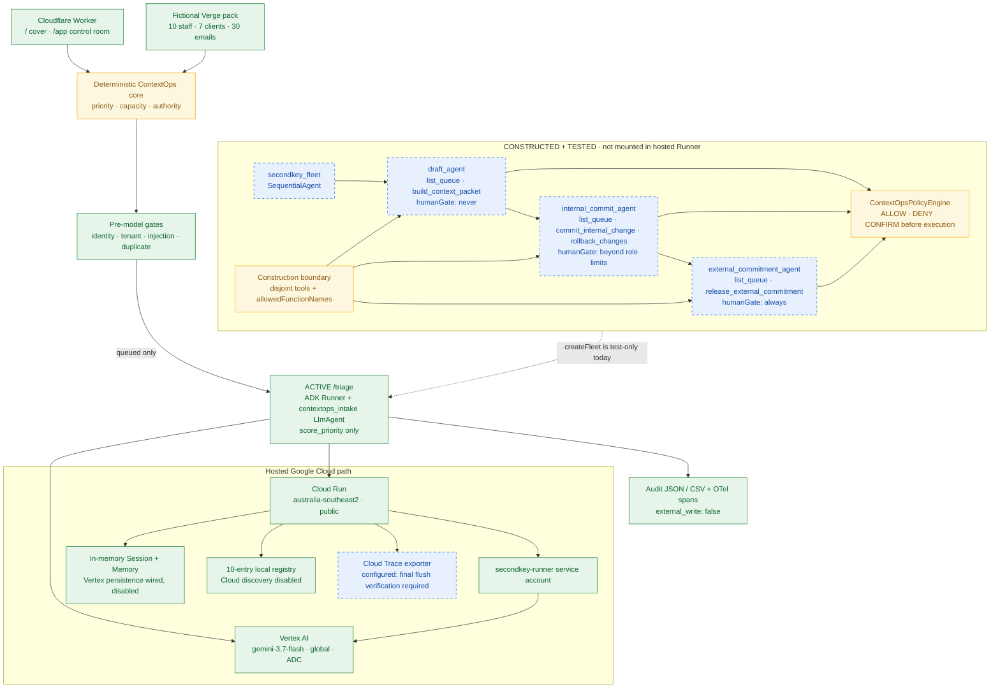
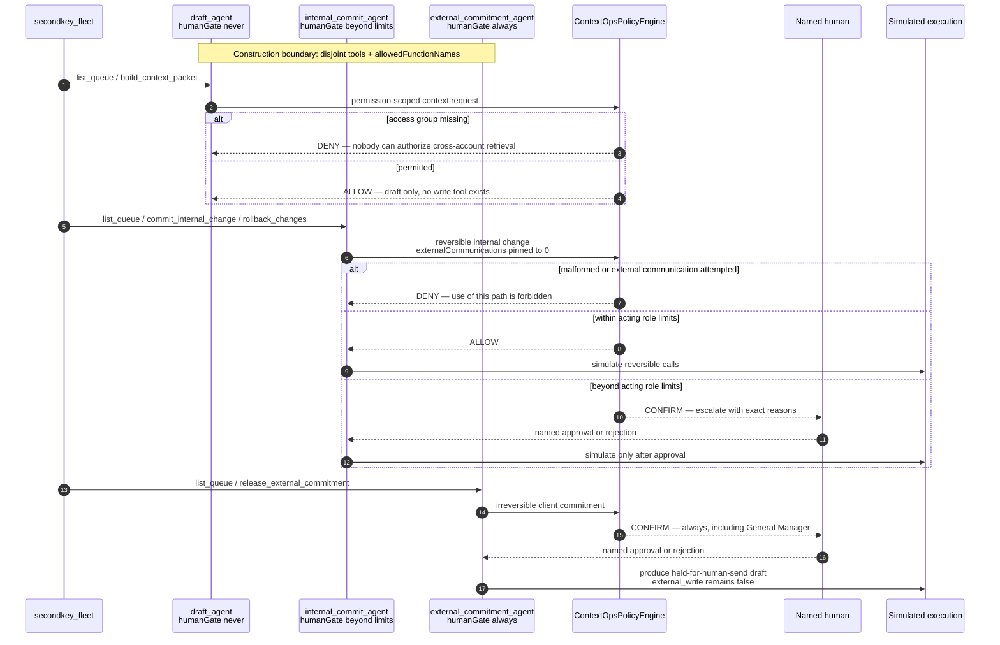

# SecondKey — System Architecture

> The agent holds the first key. Irreversible actions wait for yours.

## Submission architecture

Solid arrows are executed in the hosted submission. Dashed arrows are implemented
and tested but disabled or not mounted. This distinction matters: SecondKey contains
a three-agent authority-partitioned fleet, but the hosted `/triage` route still runs
the single-purpose intake agent. `/fleet` proves the fleet definition and tool
partition; it does not prove live delegation.

Cloud Run executes in `australia-southeast2`; Gemini uses Vertex AI's `global`
location. SecondKey therefore makes no Australia-pinned inference or data-residency
claim. The current hosted UI shows `local endpoint` because it was built without
`NEXT_PUBLIC_AGENT_URL`; its demo remains functional but is not calling Cloud Run.

## Authority-partitioned fleet enforcement

The fleet has two independent enforcement layers. Construction controls what each
agent can reach. The policy engine controls what a reached tool call may do. `DENY`
means that path can never be authorized; `CONFIRM` means execution pauses for a named
human with sufficient authority.

This fleet is real code with 12 targeted tests, but `createFleet()` is currently
referenced only by `agent/tests/fleet.test.ts`. Activating it requires mounting the
coordinator in the production `Runner` and demonstrating delegation and recovery;
until then the diagram must retain the dashed, not-mounted boundary.

## Active governed paths

### Hosted Gemini triage

1. Deterministic gates resolve identity, tenant, injection and duplicate status.
2. Only queued mail reaches `contextops_intake`.
3. Gemini extracts summary, intent and explicit urgency phrases.
4. ADK forces one `score_priority` call; the tool returns the already-computed
   deterministic priority.
5. The response and audit record keep `external_write: false`.

### Portfolio approval

The interactive control room runs a deterministic application workflow. It evaluates
hours, spend, client communications and cross-account reach, then displays an approval
packet and simulated calls with shared idempotency keys. That shared execution logic
lives in import-free `lib/contextops/execution.ts` so both web and agent builds use the
same definitions. This UI workflow is not an ADK long-running/resumable workflow.

## Hackathon evidence map

| Requirement | Current evidence | Honest boundary |
|---|---|---|
| Gemini 3.5+ | Hosted `/status` reports `gemini-3.7-flash`, `vertex`, `global`; `evidence/live-triage-cloudrun.json` records a real model tool call | Model extracts; deterministic code decides |
| Google Agent Framework | Production uses ADK `Runner`, `LlmAgent`, forced `FunctionTool`, in-memory Session/Memory services and `SecurityPlugin` | Three-tier `SequentialAgent` is constructed/tested but not mounted |
| Google Cloud | Public Cloud Run service in `australia-southeast2`; `/status`, `/fleet` and `/triage` are reachable | `/healthz` alone returns an unresolved Google-front 404 |
| Agent Registry | 10 generated local Unit contracts served by `/registry` | Cloud Agent Registry discovery disabled |
| Agent Runtime | Active ADK request runtime | No long-running, asynchronous or cross-restart recovery proof |
| Memory Bank | Vertex services selectable by configuration | Submission uses in-memory state; persistent path not enabled or live-verified |
| Agent Identity | Deterministic application roles and tenant gates | No Google Cloud agent identity or SSO |
| Agent Gateway | `ContextOpsPolicyEngine` performs pre-tool ALLOW/DENY/CONFIRM checks | No Google Agent Gateway service; hosted POST has no auth/rate limit |
| Model Armor | Deterministic pre-model injection and protected-file gates | Google Model Armor not integrated |
| Agent Observability | JSON/CSV audit and OTel span creation; forced flush implemented and tested | Cloud Trace landing must be re-verified after deployment |

## Verification baseline

- 83 automated tests: 36 root (31 core + 5 rendered HTTP) and 47 agent.
- No live connectors or external writes.
- No production identities or customer data; all email addresses use `.example`.
- Cloud discovery and Vertex persistence remain disabled.
- The public cost-bearing `/triage` route needs a rate limiter and bounded batches;
  `max-instances=1` is not a request or spend cap.
