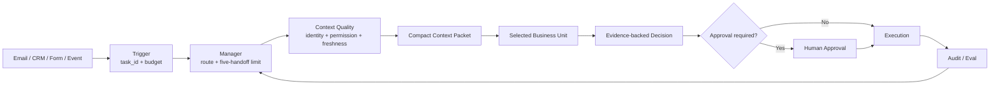
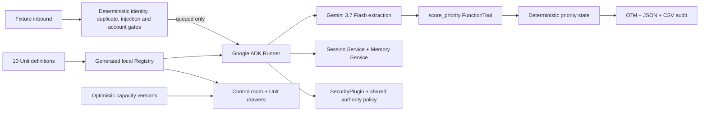
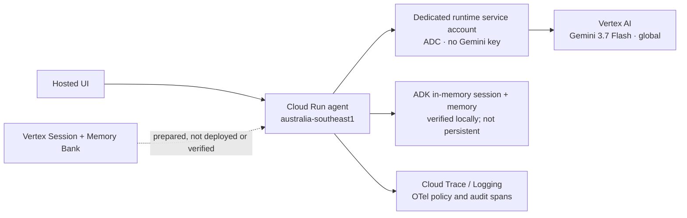

# ContextOps Architecture

## Product boundary

Exactly ten business Units are customer-visible. Trigger, Manager, Context Quality, Decision, Approval, Execution, and Audit/Eval are shared infrastructure. Demo Sandbox and Live are environments, not Units.



## Fortified runtime



## Intended Google Cloud deployment



Cloud Run placement and Gemini inference location are separate facts. The
service is intended for `australia-southeast1`; Gemini uses the Vertex AI
`global` endpoint. The project makes no claim that model inference or model
processing remains in Australia.

The LLM is deliberately outside every authority boundary. It extracts language
features and requests a tool call; server state supplies the priority and policy
result. `external_write` is false at the tool, session, audit, HTTP, and UI
boundaries.

Local Session and Memory services make the full workflow reproducible without a
cloud account. The Cloud Run deployment intentionally keeps this in-memory
state until Vertex persistence is independently deployed and verified. Prepared
Vertex services are selected only with complete project, location, Agent Engine
ID, and Application Default Credentials; partial configuration fails closed.

The registry generator projects the canonical Unit list into identical frontend
and agent JSON. Google ADK 2.0's Cloud Agent Registry client is an explicitly
enabled read/query adapter; Vertex model project/location variables never turn
it on implicitly. Publishing lifecycle resources remains an explicit cloud
deployment step and is not simulated locally.

## Shared core contracts

| Core component | Input | Output | Hard rule |
|---|---|---|---|
| Trigger | source event, tenant hint, budget | `task_id`, normalized request | Reject malformed or unidentified work |
| Manager | task, Unit catalog, handoff count | route, budget allocation | Maximum five handoffs |
| Context Quality | IDs, permissions, structured facts, knowledge | compact Context Packet | Tenant → permission → entity → status → version |
| Decision | Context Packet, deterministic rules | priority, recommendation, confidence | Structured thresholds before language reasoning |
| Approval | proposed high-risk action | approved, rejected, returned | External communication and critical writes require humans |
| Execution | approved action payload | simulated result or connector response | Demo always forces `external_write: false` |
| Audit/Eval | every input, decision and action | trace, cost, regression result | Failed safety checks block release |

## Ten Unit input/output map

| Unit | Input | Output | Primary outcome |
|---|---|---|---|
| Intake & Triage | email/form/event, entity hints, SLA | deduplicated task, priority, route | Clean work enters once and reaches the right owner |
| Customer Service | case, account context, SLA | sourced response, escalation, follow-up | Faster response without unsupported promises |
| Sales & CRM | lead/account, CRM, calls and meetings | account brief, next action, CRM draft | Consistent follow-up and cleaner pipeline |
| Operations & Scheduling | demand, skills, capacity, commitments | allocation, calendar proposal, impact | Feasible delivery plan with visible trade-offs |
| Finance Admin | invoice/expense, budget, policy | exception list, cost summary, approval | Administrative preparation only; no professional judgment |
| Knowledge & Documents | entity IDs, permission, intent | Context Packet, citations, conflicts, draft | Current, permission-safe knowledge |
| Marketing & Content | goal, audience, brand, evidence | copy, brief, slides outline, approval | Brand-safe content with evidence |
| Research & Insights | question, scope, entities, source rules | sourced brief, contradictions, open questions | Decision-ready research with uncertainty |
| People & Onboarding | role/person, skills, capacity, policy | match, checklist, training plan | Consistent staffing and onboarding operations |
| Purchase & Order | request, quotes, budget, policy | comparison, risk flags, purchase draft | Comparable, approval-ready procurement |

## Context Packet

```json
{
  "task_id": "DEMO-PORTFOLIO-001",
  "entity": { "tenant_id": "VERGE", "client_id": "CL-BH", "project_id": "PJ-BH-01" },
  "verified_facts": [],
  "relevant_evidence": [],
  "conflicts": [],
  "missing_information": [],
  "allowed_actions": ["draft_email", "create_task"],
  "external_write": false
}
```

## Confidence calculation

Confidence is a weighted system score, not a model opinion: 30% evidence coverage, 20% source authority, 15% freshness, 15% source agreement, 10% deterministic-rule coverage, and 10% historical Eval performance.

Low coverage or disagreement creates a missing-information request, draft-only result, or human escalation.
